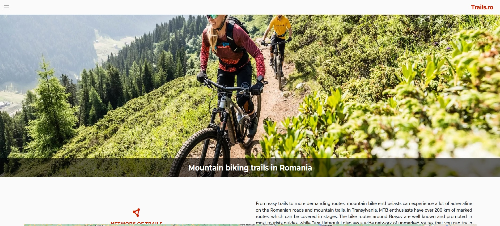
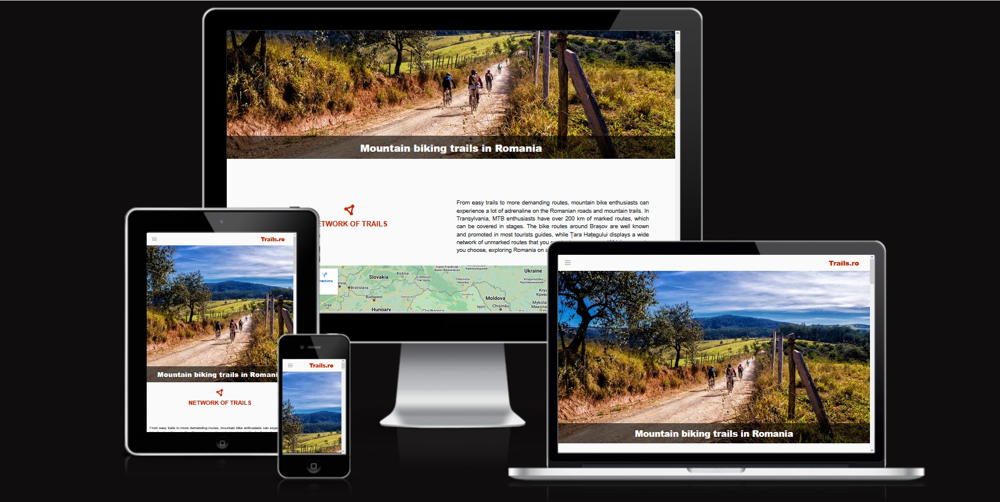
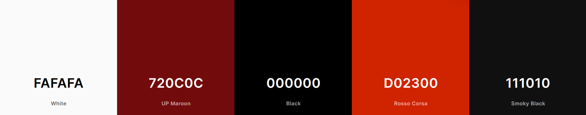

# Mountain biking trails in Romania

The Mountain biking trails in Romania website is designed to be responsive website allowing visitors to view on a range of devices. It allows visitors to find out about mountain biking trails in Romania.

## CONTENTS
___

## User Experience (UX)

___

### Initial Discusion

Mountain biking trails in Romania is a website that allows its users to find out more about mountain biking phenomen in Romania, about most known trails in the country and how to book a ride with local guides on the epic trails.

On the website you can find details about routes, locations, guides, how to prepare yourself for these rides, weather and videos on some of the trails.

#### Key information for the site

* Most and less known trails in the country.
* Locations
* How to book a ride with local guides
* How to prepare yourself for these rides.
* A way for people to cantact local guides with questions and recommendations.
* Updates on weather or closed trails.

### User Stories

#### Client Goals

* To be able to view the site on a range of device sizes.
* To make it easy for potential riders to find out more about trails and how to ride them.
* To make it clear for visitors on how should they prepare for the ride.
* To allow visitors to be able to contact local guides for further questions and how to book a ride.

#### First Time Visitor Goals
* I want updated and detailed information.
* I want to find out how i can ride romanian mountain biking trails.
* I want to be able to navigate the site, easily to find information.
* I want to be able to find guide's social media pages.
* I want to be able to book a ride, see more details about trails (pictures and videos with trails) and to contact local guides with further questions.

#### Returning Visitor Goals
* I want updated and detailed information.
* I want to find up to date information about trails, weather or guides.
* I want to be able to easily contact the guides with questions I might have.

#### Frequent Visitor Goals 

* I want a fast load time.
* I want updated and detailed information.
* I want to be able to view videos and pictures with trails and local guides.
___

### Design 
---

#### Colour Scheme

The website uses a palette of pastel colours that are used on the backgroud, headings, navigation, text and icons.

#### Typography

Google Fonts was used for the following fonts:

* Ubuntu is used for headings on the site. It is a sans-serif font.
* Montserrat is used for the body text on the site. It is a sans-serif font.

#### Imagery 
The images were used with the permission of their owners.All pictures are pictures taken by local guides when riding with tourist groups.

#### Wireframes

Wireframes were created for mobile, tablet and desktop.
No digital wireframes, only designed on paper.

#### Features

The website is comprised of four pages(home page, trails page,book page and about page), all accessible from the navigation menu.

* All Pages on the website have:
    * A header with responsive navigation bar at the top which allows the user to navigate through the site. To the right of the navigation bar is the site logo. Under the navigation and logo it is a high resolution picture with heading. To allow a good user experience of the site, navigation bar is created as burger toggler menu on all screen sizes. This was implemented to give the site a clean look and to promote a good user experience.

    * Main content is displayed on a clean design to allow users to easily find information and easy to read.

    * A footer wich contains a picture link to a big bike shop for users in case they need additional gear. Social media icon links to facebook, instagram and twitter profiles. There are also two buttons that are taking the user to about page where they can find and ask more information through a contact form or telephone.

* Home Page 

    * Main content is broken down into five sections and a map iframe, each section contains an icon with a heading, relevant text and youtube video embedded. On large screens it is displayed as a grid with two columns, on small screens it is displayed stacked verticaly.

* Trails Page

    * On trails page you can find info about trails, information such as: time to complete the run, lenght and elevation. There are four sections in the trails page, each section contain a landscape picture, a trail map picture and information mentioned above. On large screens, pictures and information is displayed horizontaly in a grid with two rows. On small screens content is displayed stacked verticaly.

* Book Page

    * On book page is a section containing general information about mountain biking trails. On large screens it is displayed as a grid with two columns, on small screens stacked verticaly. Under the section it is a booking form, allowing user to send an enquiry to check availability of local guides for preffered dates. 

* About Page

    * On about page we can find contact details for guides and another form allowing user to submit any other questions and thoughts.

* Future Implementations.

    * Use JavaScript to make forms functional.
    * Updates for guides, trails conditions and weather widgets.
    * A 24h phone line where visitors can ask any questions they might have.
    * More pictures and videos with trails and guides.
    * A feedback section, where users can post comments regarding their experience on the trails or any advice for future riders.

#### Accessibility

I have been mindful during coding to ensure that the website is as accessible friendly as possible. I achieved that by:

* Using semantic HTML
* Using descriptive alt atributes on images, iframes and a tags on the site.
* Ensuring that there is a sufficient colour contrast throughout the site

### Technologies Used 
---

#### Languages used

HTML and CSS were used to create this website.

#### Frameworks, Libraries & Programs Used

[Git](https://git-scm.com/) - For version control.

[Github](https://github.com/bubtroniq/mountain_biking_trails_in_romania) - To save and store files for the website and to deploy the website for easier testing across different devices.

[Bootstrap Version 5.2](https://getbootstrap.com/) - Code for navigation bar. Additional CSS styling was also implemented in style.css

[Google Fonts](https://fonts.google.com/) - To import the fonts used on the website.

[Font Awesome](https://fontawesome.com/) - For iconography on the website.

[Favicons.io](https://favicon.io/) To create favicon.

[Am i Responsive?](https://ui.dev/amiresponsive?url=https://bubtroniq.github.io/mountain_bike_trails/index.html) To show the website image on a range of devices.

### Deployement & Local Development 
---

#### Deployement

Github Pages was used to deploy the live website. The instructions to achieve this are below:

1. Log in (or sign up) to Github.
2. Find the repository for this project, mountain-bikin-trails-in-romania.
3. Click on the Settings link.
4. Click on the Pages link in the left hand side navigation bar.
5. In the Source section, choose main from the drop down select branch menu. Select Root from the drop down select folder menu.
6. Click Save. Your live Github Pages site is now deployed at the URL shown.

#### Local Development

##### How to fork

To fork the mountain-bikin-trails-in-romania repository:

1. Log in(or ign up) to Github.
2. Go to the repository for this project, bubtroniq/mountain_biking_trails_in_romania.
3. Click the Fork button in the top right corner.

##### How to Clone 

To clone the mountain-bikin-trails-in-romania repository:

1. Log in (or sign up) to GitHub.
2. Go to the repository for this project, bubtroniq/mountain_biking_trails_in_romania.
3. Click on the code button, select whether you would like to clone with HTTPS, SSH or GitHub CLI and copy the link shown.
4. Open the terminal in your code editor and change the current working directory to the location you want to use for the cloned directory.
5. Type 'git clone' into the terminal and then paste the link you copied in step 3. Press enter.

