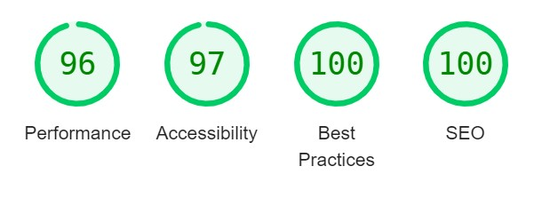
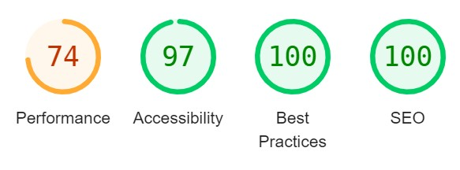

# Testing
---
## During Development Testing

Testing was ongoing throughout the entire build. I utilised Firefox developer tools while building to pinpoint and troubleshoot any issues as I went along.
 1. Manually testing each element for appearance and responsiveness via a simulated live server using an extension in VSCode.
 2. Published the page via GitHub pages and used my mobile phone and tablet for testing different screen sizes.
### Manual Testing
During testing, I used two different browsers to ensure cross-compatibility. The desktop browsers used by myself were:
 1. Firefox
 1. Chrome

I then used the devtools to simulate different screen sizes/devices from 360 px up to 4000px in width.

The following issues were raised during my mid project meeting with my mentor:

* The trails section was overflowing, causing horizontal scrooling on hover
* Footer button were wraped in an achor tag, cauzing errors.
* Poor HTML comments
* Semanticaly wrong commit messages.
* To improve forms contrast for better accessibility.

## Post Development Testing

### Validators

HTML - https://validator.w3.org/nu/

CSS - https://jigsaw.w3.org/css-validator/
 - All pages tested, no issues found via URL or file upload

### Lighthouse Scores 
#### Test Conditions 
 - I did all lighthouse tests in incognito mode to avoid interference from browser extensions.
 - I ran the tests for both mobile and desktop.
 - I asked people to run lighthouse tests from their own devices.
##### Desktop Version:
I have only included one screenshot for desktop as all pages were the same score, only changing by one or two points in performance if I ran it multiple times.

##### Mobile Version:

